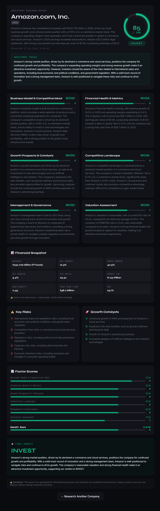
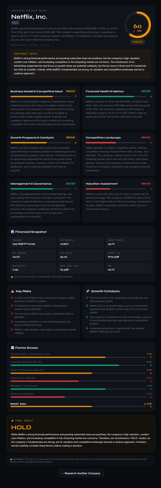
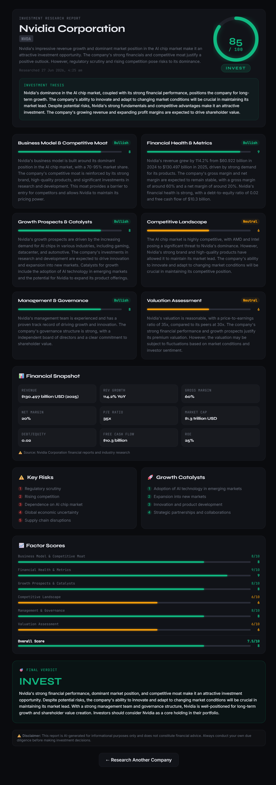
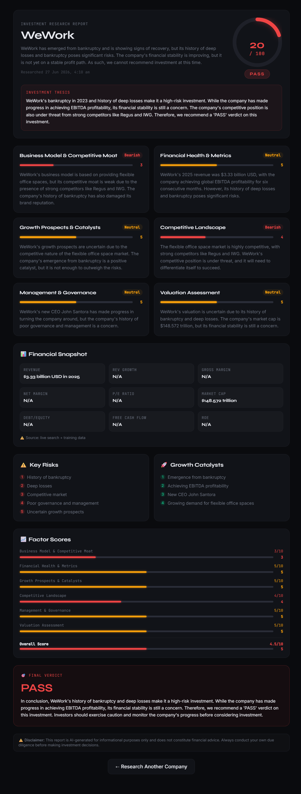

# AlphaSignal — AI Investment Research Agent

> Enter any company. The AI agent researches it using live web data and delivers a clear **INVEST / PASS / HOLD** verdict with scored analysis, financial snapshot, risks, and catalysts.

🔗 **Live Demo:** https://alpha-signal-sigma.vercel.app/
📦 **GitHub:** https://github.com/sabeena0/AlphaSignal

---

## Overview

AlphaSignal is a full-stack AI investment research agent built with **Next.js**, **LangChain.js**, and Groq (Llama 3.3 70B). You type in a company name and the agent:

1. **Runs 3 parallel live web searches** using Tavily — fetching latest financials, news, and competitor data
2. **Summarises raw search data** using LangChain Chain 1: `PromptTemplate → LLM → StringOutputParser`
3. **Synthesises a structured investment report** using LangChain Chain 2: `PromptTemplate → LLM → JsonOutputParser`
4. **Delivers a verdict** — INVEST / PASS / HOLD — with a 0–100 confidence score, 6 scored dimensions, financial snapshot, risks, and catalysts
5. **Streams progress live** to the UI via Server-Sent Events

---
## Understanding the Verdicts

AlphaSignal delivers one of three verdicts for every company analysed:

| Verdict | Meaning | Confidence Score |
|---|---|---|
| 🟢 **INVEST** | Strong fundamentals, reasonable valuation, clear upside — buy | 65–100 |
| 🟡 **HOLD** | Decent business but mixed signals — don't buy more, don't sell | 40–65 |
| 🔴 **PASS** | Weak fundamentals, overvalued, or serious concerns — avoid | 0–45 |

### What each verdict means in practice

**INVEST** — The agent found strong fundamentals, a clear competitive moat, and reasonable valuation. Catalysts outweigh risks. Example: *Nvidia (85)* — dominant AI chip market position, 114% revenue growth, strong margins.

**HOLD** — The company is good but either too expensive, facing near-term uncertainty, or has mixed signals. Example: *Netflix (60)* — strong subscriber growth and margins, but P/E of 55x is expensive relative to peers and content cost inflation is an ongoing headwind.

**PASS** — Clear reasons to avoid. Either bankruptcy, fraud, deep losses with no recovery path, or fundamentally broken business model. Example: *WeWork (20)* — filed Chapter 11 bankruptcy in 2023, structural lease liability crisis, governance failure.

> The confidence score (0–100) reflects how strongly the agent feels about its verdict. A score of 85 INVEST is a strong buy signal. A score of 55 INVEST is a cautious positive view.


## How to Run

### Prerequisites
- Node.js 18+
- Groq API key (free) — console.groq.com
- Tavily API key (free, 1000 searches/month) — tavily.com

### Setup

```bash
# 1. Enter the project directory
cd investment-agent

# 2. Install dependencies
npm install --legacy-peer-deps

# 3. Configure environment variables
cp .env.example .env.local
# Edit .env.local with your API keys

# 4. Run the development server
npm run dev

# 5. Open http://localhost:3000
```

### Environment Variables (`.env.local`)

```env
LLM_PROVIDER=groq
GROQ_API_KEY=gsk_...
TAVILY_API_KEY=tvly-...
```

### Getting Free API Keys

| Key | Where | Time |
|---|---|---|
| Groq | console.groq.com → API Keys | 2 minutes |
| Tavily | tavily.com → Sign up | 2 minutes |


## How It Works — Architecture

```
User Input (company name)
        │
        ▼
  POST /api/analyze          Next.js API Route (SSE stream)
        │
        ▼
┌─────────────────────────────────────────────────────┐
│              LangChain Pipeline                     │
│                                                     │
│  STEP 1 — Parallel Web Research (Tavily ×3)        │
│  • financials: revenue, margins, metrics            │
│  • news: earnings, analyst ratings, events          │
│  • competitors: market share, landscape             │
│                    │                                │
│                    ▼                                │
│  STEP 2 — Chain 1: Research Summariser             │
│  RunnableSequence:                                  │
│  PromptTemplate → LLM → StringOutputParser          │
│  (raw search results → clean research brief)        │
│                    │                                │
│                    ▼                                │
│  STEP 3 — Chain 2: Synthesis                       │
│  RunnableSequence:                                  │
│  PromptTemplate → LLM → JsonOutputParser            │
│  (research brief → structured InvestmentReport)     │
└─────────────────────────────────────────────────────┘
        │
        ▼
  SSE stream → React UI
  (ScoreRing, ReportView, StepTracker)
```

### LangChain Components Used

| Component | Purpose |
|---|---|
| `PromptTemplate` | Structured prompt management for both chains |
| `RunnableSequence` | Chains steps into a pipeline |
| `StringOutputParser` | Parses LLM text in Chain 1 |
| `JsonOutputParser` | Parses structured JSON in Chain 2 |
| `ChatGroq` | Groq LLM provider (Llama 3.3 70B) |
| `ChatOpenAI` | OpenAI provider fallback |
| `ChatAnthropic` | Anthropic provider fallback |

### Key Files

| File | Purpose |
|---|---|
| `lib/agent.ts` | Core LangChain pipeline — searches, chains, parsers |
| `app/api/analyze/route.ts` | Streaming SSE API endpoint |
| `app/page.tsx` | Main UI — idle / loading / done / error states |
| `components/StepTracker.tsx` | Real-time step progress |
| `components/ReportView.tsx` | Full report renderer |
| `components/ScoreRing.tsx` | Animated SVG confidence ring |

---

## Key Decisions & Trade-offs

### LangChain RunnableSequence over raw API calls
Using `RunnableSequence` with `PromptTemplate` and output parsers makes the pipeline composable and easy to extend. Swapping the LLM provider is one env variable change.

### Two-chain architecture
Separating summarisation (Chain 1) from synthesis (Chain 2) produces better results. Chain 1 is in "gather and condense" mode; Chain 2 is in "structured analysis" mode. Mixing both degrades quality.

### Groq as default LLM
Groq is free, requires no credit card, and runs Llama 3.3 70B at ~500 tokens/second — 3-5x faster than OpenAI for similar quality. The provider abstraction means switching to GPT-4o or Claude is one env variable.

### Parallel web searches
All 3 Tavily searches run via `Promise.all()` simultaneously — cuts search time from ~9s to ~3s.

### Timeout protection on all chains
Each search has a 7s timeout, all searches have an 18s global timeout, Chain 1 has a 12s timeout with fallback to raw data. The agent never hangs — it always produces a report.

### Server-Sent Events for streaming
Live step-by-step progress updates make 30-second waits feel fast. Users see each step complete in real time.

### What I left out
- **LangGraph state machine** — original design used a full ReAct agent loop; simplified to a pipeline for reliability on Vercel Hobby plan
- **Vector DB / RAG** — caching past reports in FAISS/Pinecone for instant re-queries
- **Portfolio tracking** — saving reports per user, comparing companies
- **Source citations** — showing which Tavily result each claim came from
- **Rate limit handling** — detecting Groq 429 errors and showing friendly wait messages
- **Authentication** — no user accounts; stateless demo

---

## Example Runs

### 1. Amazon — INVEST (Confidence: 85)



**Verdict: INVEST** — Amazon's strong market position in e-commerce and cloud services, combined with $742.8B revenue (FY2026) and expanding operating margins of 5.4%, makes it an attractive investment opportunity. AWS continued growth and advertising business expansion are key catalysts.

| Metric | Value |
|---|---|
| Revenue | $742.8B (FY2026) |
| Revenue Growth | 16.3% YoY |
| Gross Margin | 40.5% |
| Net Margin | 5.4% |
| P/E Ratio | 23.4x |
| Market Cap | $1.23 trillion |

---

### 2. Netflix — HOLD (Confidence: 60)



**Verdict: HOLD** — Netflix's strong financial performance ($45.2B revenue, 15.85% growth) and 282M+ subscribers are positives, but its premium P/E of 55.2x and high valuation relative to peers warrants caution. Content cost inflation and FX headwinds add uncertainty.

| Metric | Value |
|---|---|
| Revenue | $45.2B (FY2025) |
| Revenue Growth | 15.85% YoY |
| Net Margin | 24.3% |
| P/E Ratio | 55.2x |
| Market Cap | $274.5B |

---

### 3. Nvidia — INVEST (Confidence: 85)



**Verdict: INVEST** — Nvidia's dominance in the AI chip market, with 114.2% revenue growth (FY2024→FY2025) to $130.5B, 60% gross margins, and 70-95% market share in AI training chips makes it the defining infrastructure play of the AI era. At 35x P/E, valuation is full but justified.

| Metric | Value |
|---|---|
| Revenue | $130.5B (FY2025) |
| Revenue Growth | 114.2% YoY |
| Gross Margin | 60% |
| Net Margin | 20% |
| P/E Ratio | 35x |
| Market Cap | $1.3 trillion |

---

### 4. WeWork — PASS (Confidence: 20)



**Verdict: PASS** — WeWork filed Chapter 11 bankruptcy in 2023 due to deep losses and unsustainable lease liabilities. While the company has achieved EBITDA profitability for six consecutive months post-restructuring, its history of governance failure, brand damage, and structural business model weaknesses make it uninvestable at this stage.

| Metric | Value |
|---|---|
| Revenue | $3.33B (2025) |
| Business Model Score | 3/10 |
| Competitive Moat | Weak |
| Overall Score | 4.5/10 |

---

## What I Would Improve With More Time

1. **Restore LangGraph state machine** — a proper ReAct agent that dynamically decides how many searches to run and can follow up on findings
2. **Source citations** — show which Tavily result each claim comes from with clickable links
3. **Rate limit handling** — detect Groq 429 errors and show "Please wait 30 seconds" instead of hanging
4. **Persistent report caching** — store reports in Supabase so repeat queries are instant and shareable via URL
5. **Better Indian market coverage** — dedicated Screener.in and Moneycontrol scrapers for BSE/NSE companies
6. **Multi-company comparison** — side-by-side scoring of 2-3 companies in the same sector
7. **PDF export** — downloadable polished report for sharing
8. **Portfolio mode** — build a watchlist, track verdict changes over time
9. **Confidence calibration** — back-test verdicts against actual 1-year returns to tune scoring
10. **Authentication and rate limiting** — essential before any public production deployment

---

## Tech Stack

| Layer | Tech |
|---|---|
| Frontend | Next.js 14 (App Router), React 18, Tailwind CSS |
| Backend | Next.js API Routes, Server-Sent Events |
| AI Orchestration | LangChain.js (RunnableSequence, PromptTemplate, JsonOutputParser) |
| LLM | Groq Llama 3.3 70B / OpenAI GPT-4o / Anthropic Claude |
| Web Search | Tavily API (live 2024/2025 data) |
| Deployment | Vercel |

---

## Disclaimer

This tool is AI-generated for informational and educational purposes only. It does not constitute financial advice. Always conduct your own due diligence before making any investment decisions.

---

*Built for the InsideIIM × Altuni AI Labs AI Product Development Engineer internship assignment.*
